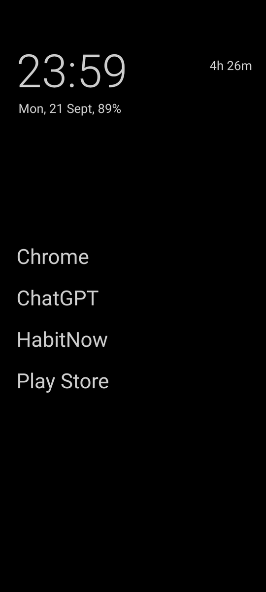
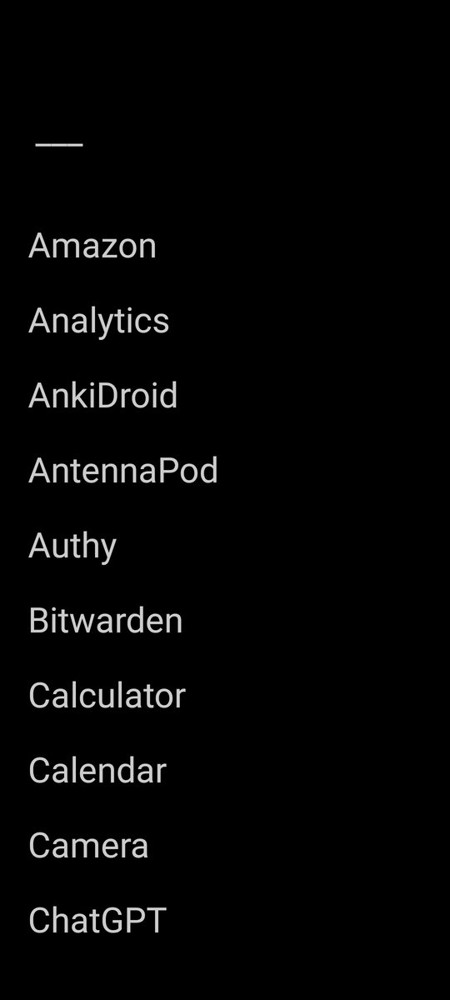
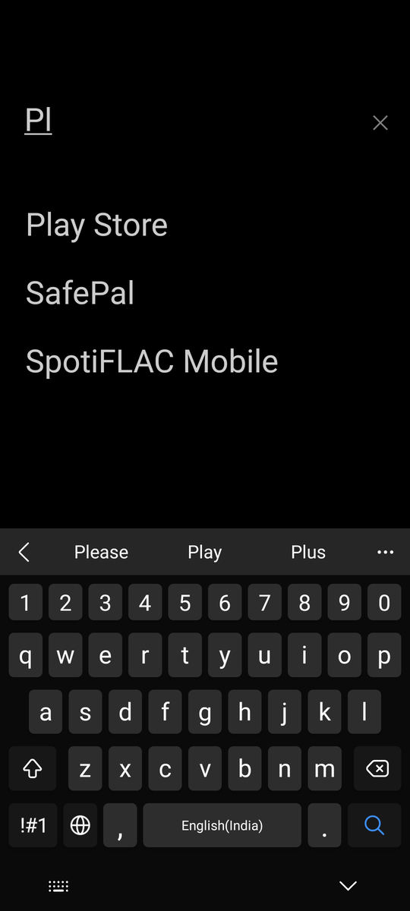
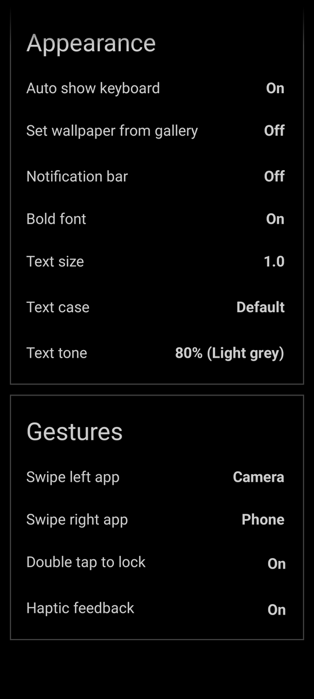
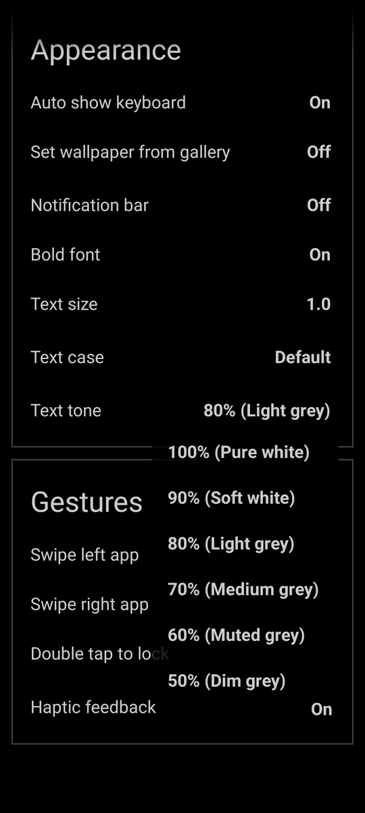

<div align="center">


# 🌸 黒 Kuro Launcher ✨

### **The Distraction-Free, Pure Pitch-Black AMOLED Android Launcher**

A hyper-minimalist, 1-bit AMOLED Android launcher designed to reclaim your attention and time.  
Zero ads · Zero tracking · Pure pitch black `#000000` · Instant fuzzy search · Sub-millisecond navigation.

<br>

[](https://github.com/Praveensenpai/KuroLauncher/releases/latest)
[](https://github.com/Praveensenpai/KuroLauncher)
[](https://kotlinlang.org)
[-94e2d5?style=for-the-badge&logo=googleplay&logoColor=black)](https://github.com/Praveensenpai/KuroLauncher/releases/latest)
[](LICENSE)
[](https://github.com/Praveensenpai/KuroLauncher)

<br>

[✨ Key Features](#-key-features) • [📱 Screenshots](#-visual-showcase) • [⚡ Quick Install](#-quick-download--install) • [🔄 Architecture](#-system-architecture) • [🛠️ Build from Source](#%EF%B8%8F-building-from-source) • [📜 Credits & License](#-upstream-attribution--credits)

</div>

---

> [!NOTE]
> ### 🌸 Upstream Attribution & Credits
> **Kuro Launcher** (黒) is an enhanced, dark-purist fork of the renowned [**Olauncher**](https://github.com/tanujnotes/Olauncher) originally crafted by **[Tanuj (@tanujnotes)](https://github.com/tanujnotes)**.  
> All core minimalist design philosophy originated from Tanuj's visionary project. Deep gratitude and respect to Tanuj for building one of the cleanest, most focused open-source Android projects in existence.  
> • **Original Repository**: [github.com/tanujnotes/Olauncher](https://github.com/tanujnotes/Olauncher)  
> • **Original Author**: [Tanuj (@tanujnotes)](https://x.com/tanujnotes) • [Website](https://tanujnotes.substack.com)

---

## 📱 Visual Showcase

<div align="center">

| 🌌 **Minimalist Home** | ⚡ **Alphabetical Drawer** | 🔍 **Instant Fuzzy Search** |
| :---: | :---: | :---: |
|  |  |  |
| *Distraction-free home with live clock, date, and essential apps* | *Clean vertical list with fast-scrolling alphabetical index* | *Instant acronym & character match with auto-keyboard* |

<br>

| ⚙️ **Settings & Gestures** | 🎨 **Monochrome Text Tones** |
| :---: | :---: |
|  |  |
| *Custom swipe actions, text sizing, and AMOLED wallpapers* | *6 true neutral grayscale tone presets (100% down to 50%)* |

</div>

---

## ⚡ Why Kuro Launcher?

Most modern launchers bombard you with notification badges, colorful grid icons designed for dopamine spikes, and bloated news feeds. **Kuro Launcher strips all of that away.**

```text
                      ┌─────────────────────────────────────────┐
                      │            黒 Kuro Launcher             │
                      │   Minimalist Distraction-Free Android   │
                      └────────────────────┬────────────────────┘
                                           │
         ┌─────────────────────────────────┼─────────────────────────────────┐
         ▼                                 ▼                                 ▼
┌───────────────────┐             ┌───────────────────┐             ┌───────────────────┐
│   Pure AMOLED     │             │ Lightning Search  │             │ Biometric Privacy │
│ · True #000000    │             │ · Fuzzy matching  │             │ · Fingerprint/PIN │
│ · 1-bit Wallpaper │             │ · Acronym queries │             │ · Hidden apps box │
│ · 0% Battery Drain│             │ · Auto-launch (1x)│             │ · Zero analytics  │
└───────────────────┘             └───────────────────┘             └───────────────────┘
```

> [!TIP]
> **True Pitch-Black Battery Advantage**  
> On OLED and AMOLED screens, black pixels (`#000000`) physically turn off individual self-lit diodes, consuming virtually **0 mW of display power**. Kuro Launcher's interface and bundled wallpaper are locked to authentic 1-bit black for maximum battery endurance.

---

## ✨ Key Features

| Category | Feature | Technical Highlights |
| :--- | :--- | :--- |
| 🌌 **AMOLED Dark** | **True `#000000` AMOLED Purism** | Permanently black theme; no light-mode restarts, zero blinding flashes, and true 1-bit AMOLED default wallpaper. |
| 🎨 **Typography** | **Monochrome Text Tone Presets** | 6 precise neutral grayscale presets (`100% Pure White`, `90% Soft White`, `80% Light Grey`, `70% Medium Grey`, `60% Muted Grey`, `50% Dim Grey`) free from blue/fog tint. |
| 🔍 **Search** | **Intelligent Fuzzy & Acronym Search** | Instant character matching across labels and acronyms (e.g. `cgpt` → `ChatGPT`, `yt` → `YouTube`, `ps` → `Play Store`) with single-match auto-launch. |
| ✕ **Ergonomics** | **Quick-Clear Search & Gestures** | Dedicated clear button (`✕`) plus smart back-press hierarchy that clears the typed query before closing the drawer. |
| 🔒 **Security** | **Biometric App Concealment** | Guard confidential or distracting apps inside a hidden locker locked behind Android BiometricPrompt (fingerprint, face, or PIN). |
| 📳 **Haptics** | **Tactile Vibration Feedback** | Subtle haptic tick feedback on swipe actions and app launches (fully toggleable in Settings). |
| 🔤 **Styling** | **Text Case & Size Formatting** | Toggle between **Default**, **lowercase**, or **UPPERCASE** text styles with granular font scaling. |
| 🖼️ **Wallpapers** | **Direct Gallery Wallpaper Picker** | Apply any custom photo or artwork directly from your gallery without requiring external wallpaper utilities. |
| 🛡️ **Privacy** | **Zero Telemetry & 100% Offline** | Stripped of background analytics, crash loggers, promotional banners, review dialogs, and external tracking domains. |

---

## 🚀 Quick Download & Install

### 🪄 Direct GitHub Release (Recommended)

Kuro Launcher is distributed as a single ultra-lightweight **Universal APK (2.16 MB)** that runs natively on all modern ARM (`arm64-v8a`, `armeabi-v7a`) and x86 devices:

👉 **[Download Kuro Launcher v0.2.1 APK](https://github.com/Praveensenpai/KuroLauncher/releases/latest)**

#### Direct Download via GitHub CLI (`gh`):
```bash
gh release download --repo Praveensenpai/KuroLauncher --pattern "*.apk"
```

#### Stream Install via ADB:
```bash
adb install -r kuro-launcher-v0.2.1.apk
```

---

## 🔄 System Architecture

Kuro Launcher is built with high performance and zero overhead in mind, avoiding bloated UI frameworks:

```text
Android OS (Home Intent / Window Insets)
  └─> MainActivity (Single Activity Host, Navigation Graph, System UI Controller)
        ├─> NavController (res/navigation/nav_graph.xml)
        │     ├─> HomeFragment (Minimal Text Apps, Gestures, Live Clock/Date Header)
        │     ├─> AppDrawerFragment (Alphabetical App List, Fuzzy Search Bar, Fast Scroll)
        │     │     └─> AppDrawerAdapter (App Rows, Section Headers, Private Space)
        │     └─> SettingsFragment (Text Tone, Alignment, Hidden Apps, Gestures)
        └─> MainViewModel (Shared State, App Discovery, Search Filter, Usage Stats)
              ├─> LauncherApps / PackageManager (Application Discovery & Launch)
              ├─> AppFilterHelper (Fast Substring & Subsequence Character Search)
              ├─> Prefs (SharedPreferences Encapsulation)
              └─> AppUsageStats / UsageStatsManager (Digital Wellbeing Tracking)
```

---

## 🛠️ Building from Source

### Prerequisites
- **JDK 17** or **JDK 21** (`export JAVA_HOME=/path/to/jdk`)
- **Android SDK 36**

### Build Commands:
```bash
# 1. Clone repository
git clone https://github.com/Praveensenpai/KuroLauncher.git
cd KuroLauncher

# 2. Assemble Debug APK
./gradlew assembleDebug

# 3. Assemble Release APK
./gradlew assembleRelease
```

The signed release APK will be located at:
```text
app/build/outputs/apk/release/app-release.apk
```

---

## 📜 Upstream Attribution & Credits

- **Original Project**: [Olauncher](https://github.com/tanujnotes/Olauncher) by **[Tanuj (@tanujnotes)](https://github.com/tanujnotes)**.
- **License**: Kuro Launcher is licensed under the [GNU General Public License v3.0 (GPL-3.0)](LICENSE) in accordance with the upstream Olauncher project.
- **Maintainer**: Praveen Senpai ([@Praveensenpai](https://github.com/Praveensenpai))
